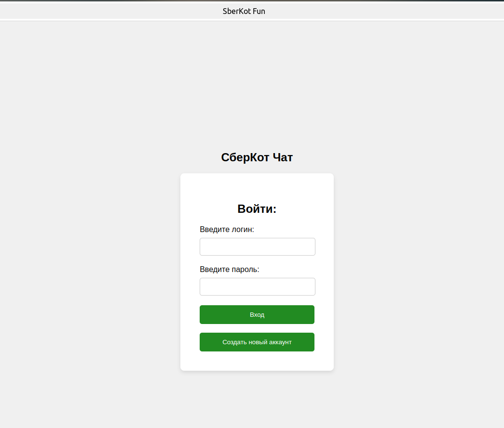
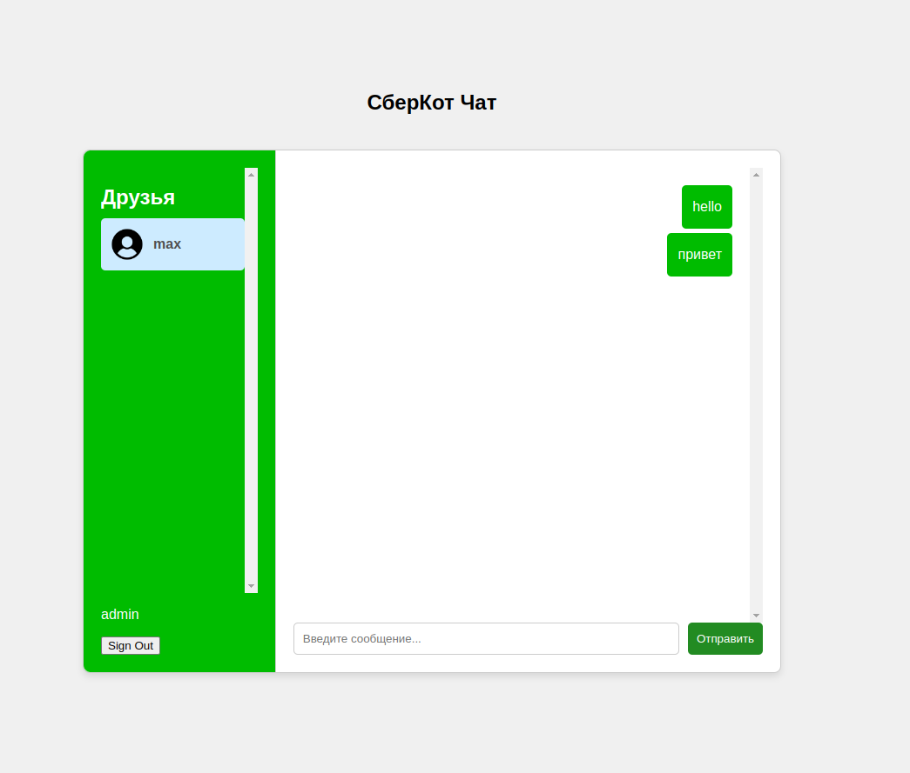
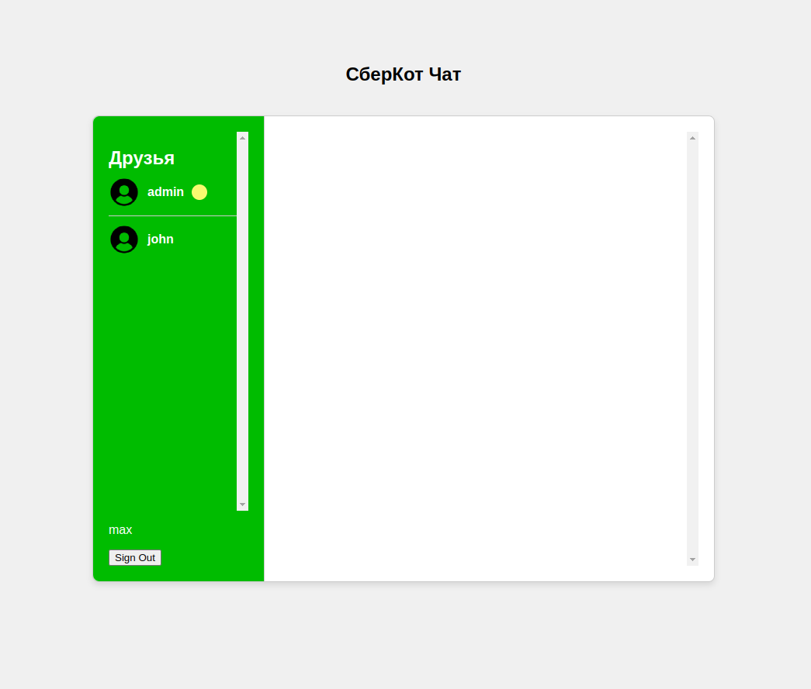

# Messenger
Не просто приложение для общения, а самый настоящий СберКотЧат!!!

Стек технологий: Spring boot, Spring security, JPA,postgresSQL, STOMP/RabbitMQ  | фронт: js, html, css
 
 Для запуска приложения нужно:
 0. Перейти по ссылке 80.90.186.69:80
 
 1. Далее нажмите на кнопку "Создать новый аккаунт" и авторизуйтесь
 2. Затем по кнопке "Уже есть аккаунт" входим в приложение 
 3. Регистрируем таким образом двух пользователей с разных браузеров
 4. Чтобы перейти к переписке с другим пользователем кликнете на него.

    желтый кружок - это уведомление о новом сообщении

    для обновления списка друзей перезагрузите страницу браузера
 5. закрыть докер контейнер `sudo docker compose down`

