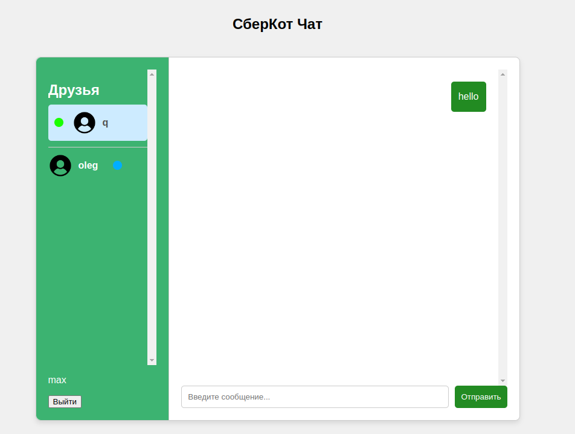

# Messenger
Не просто приложение для общения, а самый настоящий СберКотЧат!!!

Стек технологий: Spring boot, Spring security, JPA,postgresSQL, STOMP/RabbitMQ  | фронт: js, html, css
 
 Для запуска приложения нужно:
 1. в папке проекта(messenger/) выполнить команду `docker compose build`
 2. `docker compose up`
 3. в строке поиска браузера впишите `http://localhost:8080/`
    должна открыться следующая страница
 
 4. Далее нажмите на кнопку "Создать новый аккаунт" и авторизуйтесь
 5. Затем по кнопке "Уже есть аккаунт" входим в приложение 
 6. Регистрируем таким образом двух пользователей с разных браузеров
 7. Чтобы перейти к переписке с другим пользователем кликнете на него.

    желтый кружок - это уведомление о новом сообщении

    для обновления списка друзей перезагрузите страницу браузера
 8. закрыть докер контейнер `sudo docker compose down`

